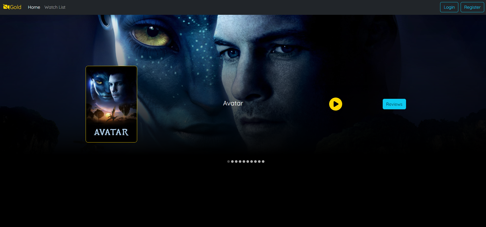

# movie-review-application

Overview
--------

Movie Review Application is a web-based platform where users can explore, watch trailers, and review their favorite movies. Built with technologies like React, React-Bootstrap, and other modern web technologies, it offers a sleek and user-friendly experience.

Features
--------

-   Browse Movies: Search and explore a wide array of movies.
-   Watch Trailers: Direct access to movie trailers for a sneak peek.
-   Write Reviews: Share your thoughts and rate movies after watching.
-   Responsive Design: Optimized for various devices and screen sizes.

Installation
------------

Follow these steps to set up the project locally:

1.  Clone the Repository:

    bashCopy code

    `git clone https://github.com/alexlux58/movie-review-application.git`

2.  Navigate to the Directory:

    bashCopy code

    `cd movie-review-application`

3.  Install Dependencies:

    bashCopy code

    `npm install`

4.  Start the Development Server:

    bashCopy code

    `npm start`

    The application will be accessible at `http://localhost:3000`.

Usage
-----

-   Use the search bar to find specific movies or browse through the collection.
-   Click on the play button to watch the trailer.
-   Click on the review button to write a review.

Contributing
------------

Contributions are welcome! Please read the [CONTRIBUTING.md](https://chat.openai.com/CONTRIBUTING.md) file for more information on how to contribute.

License
-------

This project is licensed under the MIT License - see the [LICENSE.md](https://chat.openai.com/LICENSE.md) file for details.
